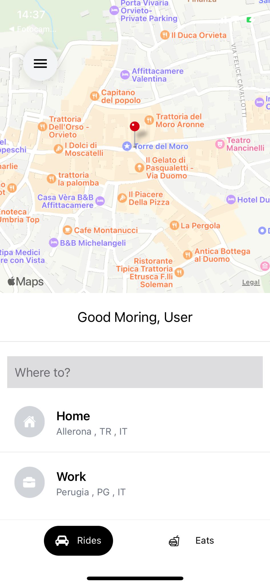
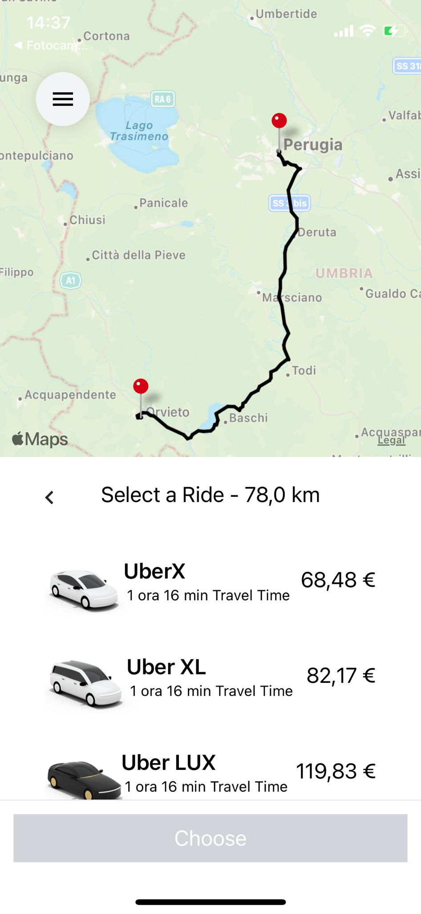

# MyUber

This app is an app that simulates the operation of uber is not complete as the uber eats part is not working, but it can be implemented in the future. The project was done with **React-Native** with google maps api and redux

- [MyUber](#myuber)
  - [Intallation](#intallation)
    - [Nodejs](#nodejs)
    - [Expo](#expo)
    - [Redux](#redux)
    - [Google Api](#google-api)
  - [Home](#home)
  - [StartScreen](#startscreen)
  - [EndScreen](#endscreen)
  - [StartProject](#startproject)

## Intallation

### Nodejs

For the installation of both Expo and React Native there is a need before the installation of **nodejs**, that it is a version higher than 14, since both frameworks are based on of it. The installation of nodejs changes depending on the operating system used, in our our case we used ubuntu, and we can install it with the following commands:

`sudo apt install nodejs`

Check the version of Node.js installed:

`nodejs -v`

Also we need NPM is a Package Manager for Node.js (Node Package Manager) needed to install modules and packages for use with Node.js.

`sudo apt install npm`

Check the version of NPM installed:

`npm -v`

### Expo

We will then go on to install expo, in which before installing there is a need to register on the official site (for free) and create the project.

To install expo:

`npm install -g expo-cli`

To verify that everything was successful.

`expo whoami`

To register for the site, type

`expo register`

After registering we can log in with the command:

`expo login`

### Redux

Redux is a predictable state container for JavaScript apps. It helps you write applications that behave consistently, run in different environments (client, server, and native), and are easy to test. On top of that, it provides a great developer experience, such as live code editing combined with a time traveling debugger. You can use Redux together with React, or with any other view library. It is tiny (2kB, including dependencies), but has a large ecosystem of addons available.

For installation:

`npm install @reduxjs/toolkit`

### Google Api

For the project google api was used, activate google api you need to go to the appropriate site and activate billing, then the api key will be generated. The following were used in the api key.

- **Places Autocomplete**
- **Distance Matrix**
- **Directions Api**

## Home

In this section we can find the search bar to look for the place where we want to go, the two views where we have if we want to book a ride or food, plus at the bottom are icons that show our references.

**As mentioned above, it is not possible to use the part for food reservation.**

## StartScreen

After selecting where you want to go with the get ride button you will be catapulted to the starting location from here we would always have a search bar that will allow us to select the destination. The destination place can also be selected with the appropriate icons in the part below. Plus you can return to the home by pressing the button in the upper left corner of the monitor.

## EndScreen

After selecting the arrival location you can see the time, kilometers, and how the price varies based on the selected car. By means of the button at the top left, it is always possible to return directly to the home or you can go back by swiping your finger across the screen.

## StartProject

React Native is installed along with expo, so we just use the cli to initialize the project

For run the project:

`expo start`

A qr code will be generated which if framed will be able to run our project on both IOS and Android, after downloading the expo app on the said device.

This project has some bugs that can be fixed in the future if decided to use, plus some installation of some libraries is omitted in case you need to consult the react-native documentation.

*Enjoy 2F*
