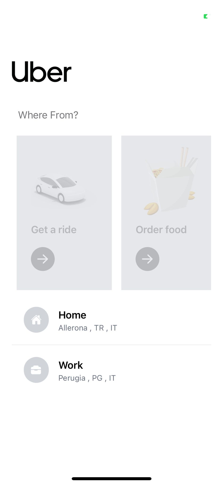
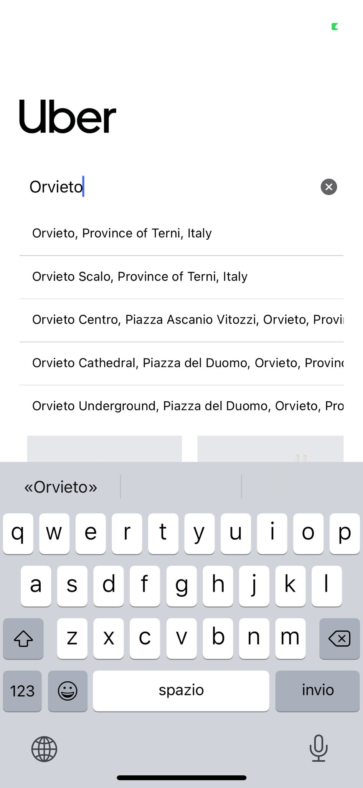
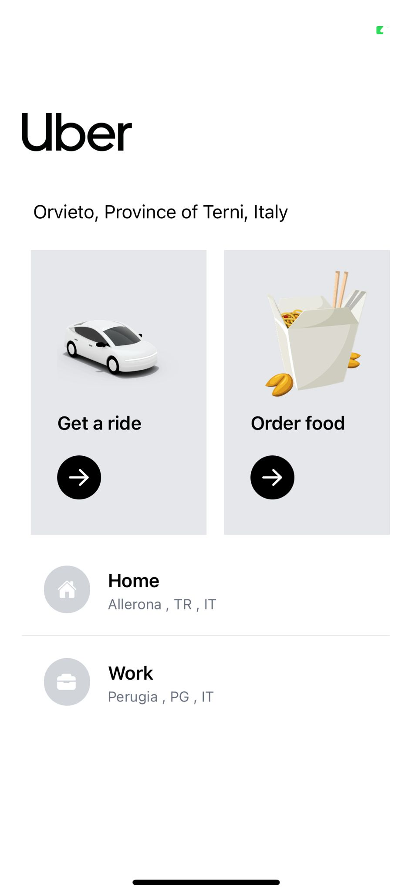

# MyUber

 

This app is an app that simulates the operation of uber is not complete as the uber eats part is not working, but it can be implemented in the future. The project was done with google maps api and redux

 

- [Installation](#intallation)

  - [Nodejs](#nodejs)

  - [Expo](#expo)

  - [Redux](#redux)

  - [GoogleApi](#google-api)

- [HomeScreen]()

 

## Intallation

 

### Nodejs

For the installation of both Expo and React Native there is a need before the installation of **nodejs**, that it is a version higher than 14, since both frameworks are based on of it. The installation of nodejs changes depending on the operating system used, in our our case we used ubuntu, and we can install it with the following commands:

 

`sudo apt install nodejs`

 

Check the version of Node.js installed:

 

`nodejs -v`

 

Also we need NPM is a Package Manager for Node.js (Node Package Manager) needed to install modules and packages for use with Node.js.

 

`sudo apt install npm`

 

Check the version of NPM installed:

 

`npm -v`

 

### Expo

We will then go on to install expo, in which before installing there is a need to register on the official site (for free) and create the project.

 

To install expo:

 

`npm install -g expo-cli`

 

To verify that everything was successful.

 

`expo whoami`

 

To register for the site, type

 

`expo register`

 

After registering we can log in with the command:

 

`expo login`

 

### Redux

Redux is a predictable state container for JavaScript apps. It helps you write applications that behave consistently, run in different environments (client, server, and native), and are easy to test. On top of that, it provides a great developer experience, such as live code editing combined with a time traveling debugger. You can use Redux together with React, or with any other view library. It is tiny (2kB, including dependencies), but has a large ecosystem of addons available.

 

For installation:

 

`npm install @reduxjs/toolkit`

 

### Google Api

 

For the project google api was used, activate google api you need to go to the appropriate site and activate billing, then the api key will be generated. The following were used in the api key.

 

- **Places Autocomplete**
- **Distance Matrix**
- **Directions Api**

## Home

In this section we can find the search bar to look for the place where we want to go, the two views where we have if we want to book a ride or food, plus at the bottom are icons that show our references.

**As mentioned above, it is not possible to use the part for food reservation.**

 

 

